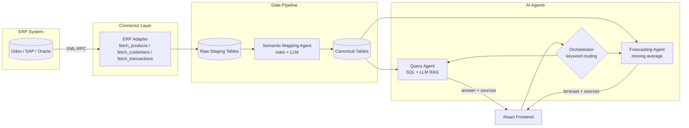

<div align="center">

# 🌒 Vesper

### AI Your ERP Data Can Actually Believe In

*A cost-effective, vendor-agnostic AI layer for legacy ERP systems*

[](https://www.python.org/)
[](https://fastapi.tiangolo.com/)
[](https://react.dev/)
[](https://www.postgresql.org/)
[](https://www.odoo.com/)
[](https://ai.google.dev/)
[](https://www.docker.com/)
[](LICENSE)

</div>

---

## Overview

SAP and Oracle have embedded generative AI copilots directly into their ERP platforms — but that AI is bundled almost exclusively with the newest cloud licensing tier, meaning a business has to pay for a platform migration before it can even license the AI on top of it. For businesses running earlier or heavily customized ERP versions — the norm rather than the exception in many markets — this puts revenue-impacting AI capability out of reach.

**Vesper** is a lightweight AI layer that sits *outside* the ERP, connecting purely through its native API, and delivers the same category of capability — natural-language querying, demand forecasting, explainable answers grounded in real data — without requiring a platform migration or per-seat AI licensing.

The MVP is built and demonstrated against **Odoo** (free, self-hostable), with the architecture explicitly designed so the same agent logic works unchanged against SAP, Oracle, or Dynamics — only the connector adapter changes per vendor.

---

## Why this exists

- **Cost is a documented, cross-industry blocker** to AI-ERP adoption, disproportionately affecting SMEs.
- **Vendor-native AI is deliberately non-portable** — SAP's own architecture team confirms its agentic AI stack depends on SAP-specific infrastructure and requires "careful architectural translation" to run elsewhere.
- **Large vendors have no commercial incentive to fix this** — cheaper, migration-free AI cannibalizes their own upgrade revenue.
- **The gap is real and current** — even major regional players are actively investing in ERP + AI modernization right now, while most mid-market businesses remain priced out of vendor-native tooling.

---

## Architecture



**Design principle:** agents never talk to the ERP directly, and never know which ERP is behind the connector. Swapping Odoo for SAP means writing a new adapter — zero changes to agent logic.

---

## Core Agents

| Agent | Purpose | Tool(s) |
|---|---|---|
| **Data Retrieval** | Pulls raw data from the ERP on a schedule | ERP API connector |
| **Semantic Mapping** ⭐ | Normalizes inconsistent legacy field names into a clean canonical schema — the core differentiator, since no ERP vendor offers this for a client's own messy field history | Rule dictionary + LLM matching |
| **Query** | Answers natural-language questions grounded in current data | SQL retrieval + LLM (RAG) |
| **Forecasting** | Predicts next-period demand per product | Moving average (pandas) |
| **Orchestrator** | Routes each question to the correct agent | Keyword rules |

Every answer returned by the Query and Forecasting agents includes the **specific source records used** — explainability is treated as a first-class requirement, not an afterthought.

---

## Tech Stack

| Layer | Tool |
|---|---|
| Backend / API | FastAPI (Python) |
| Database | PostgreSQL + SQLAlchemy |
| LLM | Google Gemini (`gemini-2.5-flash`, free tier) |
| ERP Connector | `xmlrpc.client` (Odoo XML-RPC) |
| Forecasting | pandas |
| Frontend | React (Vite) |
| Containerization | Docker Compose (Odoo + Postgres) |

No heavier agent framework (LangChain, CrewAI) — plain, debuggable function calls throughout.

---

## Getting Started

### Prerequisites
- Docker Desktop
- Python 3.11+ (3.14 supported)
- Node.js (for the frontend)
- A free [Gemini API key](https://aistudio.google.com/apikey)

### 1. Start the ERP + databases

```bash
docker compose up -d
docker compose ps   # confirm all 3 containers are running
```

Open `http://localhost:8069`, create a database (`believe_demo`), install **Inventory**, **Sales**, **Purchase** only.

### 2. Backend setup

```bash
cd backend
python3 -m venv venv
source venv/bin/activate
pip install -r requirements.txt
cp .env.example .env   # fill in GEMINI_API_KEY and Odoo credentials
python -m app.db.database   # creates schema
```

### 3. Generate the demo dataset

```bash
python -m scripts.generate_synthetic_data   # seeds Odoo with realistic patterned data
python -m scripts.sync_to_postgres          # pulls it into raw staging tables
```

### 4. Run the backend

```bash
uvicorn app.main:app --reload
```

### 5. Run the frontend

```bash
cd frontend
npm install
npm run dev
```

---

## Project Structure

```
vesper/
├── docker-compose.yml
├── backend/
│   ├── app/
│   │   ├── agents/         # Mapping, Query, Forecasting, Orchestrator
│   │   ├── connectors/     # ERP adapters (Odoo today, SAP/Oracle later)
│   │   ├── api/            # FastAPI routes
│   │   └── db/             # Schema + session management
│   └── scripts/            # Data generation, sync, cleanup utilities
└── frontend/
    └── src/                # React single-page UI
```

---

## Roadmap Beyond MVP

- Additional ERP adapters: SAP (OData / RFC), Oracle (REST), Dynamics (Dataverse)
- LLM-based orchestrator routing (currently keyword-based by design, for defensibility)
- Holt-Winters seasonal forecasting alongside moving average
- Expanded benchmark suite with automated accuracy tracking

---

## License

MIT — see [LICENSE](LICENSE) for details.

<div align="center">

*Built as part of an academic MVP project on AI-ERP integration for the Sri Lankan mid-market.*

</div>
